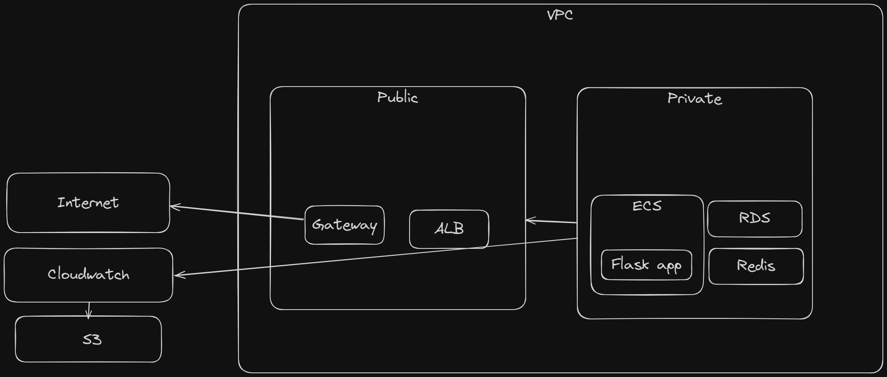
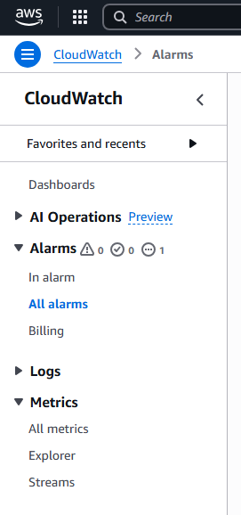

# Terraform demo

## Architektura
Základem je jednoduchá Flask aplikace, která požaduje jen nainstalovaný Python, ale pro potřeby testování dalších AWS funkcionalit jako RDS se dá jednoduše implementovat ORM, ukládání souborů do S3 bucketu, případně i napojení pro libovolný JS FE.

Flask aplikace je deploynutá v ECS clusteru v privátním subnetu, který je připojený k internetu přes gateway. Monitoring je zajištěný přes Cloudwatch který ukládá logy do S3 bucketu.



Pro deployment kontejneru je možnost použít buď ECS nebo EKS. Pro ECS jsem se rozhodl primárně z toho důvodu, že pro jednoduchou aplikaci s několika resources není důvod použít EKS - zbytečný kanón na vrabce. Pro nasazení multi-layered aplikace s desítkami až stovkami microservices by stálo za to uvažovat o EKS, ale pro jednoduché demo není důvod.
Ostatní části architektury jsou industry standards. Šlo by přesunout ECS do public subnetu, což by ulehčilo build a zjednodušilo Terraform networking - ECS tasks vyžadujou přístup k repozitáři, do kterýho se nedostanou bez NAT Gateway nebo mimo public subnet, ale v rámci zachování security jsem se rozhodl pro tohle řešení.

## CI/CD
Pro CI/CD jsou využity GitHub actions. Po každém pushi do repozitáře se rebuildne Docker image, který se následně pushne do ECR a deployne do ECS.
Dockerfile je co nejjednodušší pro deployment, obsahuje jenom Python 3.9 a Flask.

## Deployment
Je třeba setupnout Github secrets `AWS_ACCESS_KEY_ID`, `AWS_ACCOUNT_ID`, `AWS_REGION` a `AWS_SECRET_ACCESS_KEY`. Pro Terraform je možnost setupnout secrety 2 způsoby:
1) Přes env variables
```
export AWS_ACCESS_KEY_ID="your-access-key-id"
export AWS_SECRET_ACCESS_KEY="your-secret-access-key"
export AWS_REGION="your-aws-region"
```
2) Přes AWS CLI. Terraform si vezme config defaultně
```
aws configure
```

Před deploymentem do AWS je třeba inicializovat Terraform, aby si stáhnul příslušné modely.
```
terraform init
```
Best practice před deploymentem je se podívat přes plan, co se vlastně nasadí:
```
terraform plan
```
Infrastruktura se deployne jednoduše:
```
terraform apply
```
Pokud je potřeba rollback nebo přidání nových resources, jsou dva způsoby:
1) Změna *.tfstate souboru z backupu
2) Změna *.tf souborů

Postup je následně stejný:
```
terraform plan
terraform apply
```

Infrastruktura se smaže následně:
```
terraform destroy
```

## Monitoring
Monitoring je zajištěný přes Cloudwatch, který logy ukládá do S3 bucketu. Přes AWS konzoli je možný monitoring, případně použít jako Cloudwatch jako source pro jiné monitoring aplikace, např. Grafana
